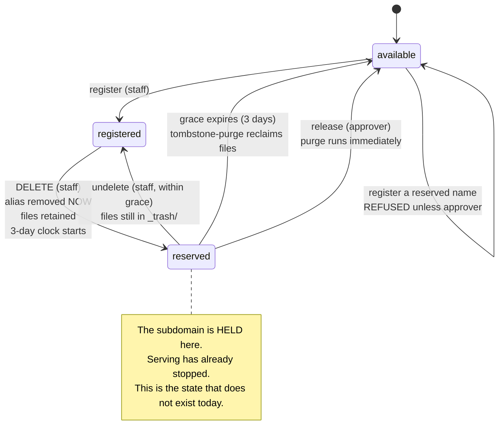

# Local design 0006 — Deleting a site: unpublish now, reserve the name, reclaim later

> **Status:** accepted (2026-08-21), implemented except step 7b (2026-08-25) · **Decision:** the
> operator's. Refines the delete semantics ADR-016 leaves to implementation. Serve plane unchanged.
>
> Steps 1-6 and 7a are on `main` and unreleased. Step 7b — the approver-gated early-release
> endpoint — does not exist; there is no release route in `internal/server/server.go`. Two
> statements below were true when this was written and are not now: the "seven sites are already
> broken" remediation names `?purge=true`, which is retired by step 7a, and the current procedure
> is a plain `DELETE` (`docs/COMPATIBILITY.md` entry 22); and `R2Store.DeleteAlias` exists.

## The decision

Deleting a site must do three things it does none of today: **stop serving immediately**, **hold
the subdomain against reuse**, and **reclaim the files after a grace period**. The subdomain
becomes a reserved name that only an approver can release early; without that release it frees
itself when the grace expires.

The serve plane is not touched. Caddy continues to read R2 aliases directly with no registry
lookup — deletes are rare and requests are not, so correctness is established at write time and
audited nightly in batch.

## Why this matters more than a storage leak

The motivating case is a **takedown**. If content must come off `<site>.freecode.camp` now, the
operator's only lever is `DELETE`, and `DELETE` does not take the site down. Four deleted sites
are serving real content as of 2026-08-21 — *LinguaGrid*, *Pomodoro Timer*, *Rubik's Rotate*,
*Medical Terminology Decoder*. Three named staff have each deleted a site believing it went dark.

Storage is the lesser problem. Publication is the compliance one.

## The missing state: a name can be reserved

The current model has two states for a subdomain — taken, or free. That is what forces the bug:
the moment the registry row goes, the name reads as free while the site is still up, so the next
person to claim it inherits a stranger's live content.

The model needs a third state.

**Serving stops on the transition into `reserved`, not on the way out of it.** That separation is
the whole design: unpublishing is instant, cheap and reversible; reclaiming is deferred, expensive
and final. They are currently welded to a single flag that does neither.

## Who may do what

Reuse the authorization split that already exists — no new concept.

| Action | Team | Today's env var |
| --- | --- | --- |
| Register, delete, undelete a site | `staff` | `REGISTRY_AUTHZ_TEAM` |
| Release a reserved name early | `gh-artemis-approvers` | `REPO_APPROVE_AUTHZ_TEAM` |

Early release is the same shape of decision as approving a repository — a human confirming that a
name may be handed to someone else — so it belongs to the same approvers.

## What exists today, and what does not

Worth being exact, because the intent and the implementation diverge on every leg.

| Intended | Implemented |
| --- | --- |
| Site stops serving on delete | **No.** Non-purge delete touches only the registry row (`internal/handler/site_register.go:229-239`). The alias survives; 13 alias rows across 7 deregistered sites. |
| Files removed after grace | **No.** Nothing tombstones them, so no grace clock starts. 17 deploys, 179 MB, oldest 2026-06-06. Invisible to the drift sweep because they stay `state='active'` and `classify` skips anything indexed (`internal/gc/reconcile.go:176-178`, `internal/pg/repo.go:74`). |
| Grace of 3 days | **Partly.** `defaultCleanupGrace = 72h` (`config.go:188`) and production does not override it — but it governs deploy GC, not site deletion. |
| Owner can come back | **No.** `restore` is per-deploy. Nothing restores a site. |
| Name held against reuse | **No.** The name frees instantly while the old site keeps serving. |

One leg is *nearly* right: `?purge=true` moves the whole site prefix — aliases included, since
alias keys live under `<dirname>/` — then deletes the registry row, under a site lock
(`site_register.go:246-272`). **Its ordering is the pattern to copy. Its execution is not.**

Proven on production 2026-08-22: the move is a serial `CopyObject` + `DeleteObject` per object
(`internal/r2/r2.go:316-333`) running at roughly 0.36 objects/sec inside a 10-minute
`destructiveMoveTimeout` (`deploy_delete.go:17`). Any site above ~215 objects cannot finish. Two
of the seven orphans stalled mid-move and **kept serving**, because the alias objects sit at the
top of the prefix and were never reached. Worse, `tombstone-purge` reclaims `_trash/<site>/` only
(`internal/gc/tombstone.go:61-69,99`), so whatever a stalled move leaves at the origin prefix is
stranded permanently.

That is tracked separately, and it strengthens rather than weakens the case here: **move the alias
objects first**. Doing so takes a site down in the first second regardless of how long the bulk
takes — which is precisely the unpublish-then-reclaim split this note argues for.

## Enforcement, without touching the hot path

**At the write.** Remove the alias, then the registry row, mirroring purge's existing order and
lock. If alias removal fails, abort — the site stays registered and published, which is visible
and retryable. No ordering may produce *deregistered and still serving*, which is today's only
possible outcome and the only one that is both invisible and unfixable without a second,
differently-flagged call.

**Nightly, in batch.** `drift-detect` already sweeps at 04:00 and already reconciles R2 against the
index. It gains one set difference: R2 alias keys against registered slugs. An alias with no
registry row and no active reservation is an orphan, and is reported. One list operation per night,
nothing per request.

Make it true at the write; prove it stayed true in batch. The serve plane is never asked anything.

## Considered and rejected

- **Registry lookup in the serve plane.** Rejected by the operator on cost grounds, correctly: it
  charges every request for an event that happens a few times a year.
- **Free the name immediately and accept the collision.** This is today's behaviour and it is what
  put a stranger's content on four live URLs.
- **Purge immediately on delete, no grace.** Removes the accident-recovery window the operator
  explicitly wants, and makes a takedown unrecoverable if it was issued in error.
- **A separate reservations service.** The registry can carry the state; a second component earns
  nothing.

## Consequences

- **`DELETE` becomes a behaviour change on a public endpoint.** It will start doing what its
  callers already believe. Needs a changelog entry and a staff note.
- **Seven sites are already broken** and no code change repairs them. They need a one-time
  operator remediation — `?purge=true` per site, which works today.
- **`R2Store` needs a `DeleteAlias`.** It has `PutAlias` and `GetAlias` only
  (`internal/handler/handler.go:59-60`), which is plausibly why delete never unpublished: the
  capability was absent. `internal/r2/r2.go:225 DeleteObject` exists underneath, so this is an
  interface method, not new infrastructure.
- **A reserved name needs somewhere to live** and an expiry the purge job can read. That is the
  one genuinely new piece of state in this design.
- **Undelete has to exist**, at least as a staff-run path, or the grace period promises something
  nobody can deliver.

## Closed 2026-08-24

Both open choices are now decided. Neither changes the model above.

**The grace clock is stored per-site, not derived from tombstone rows.** Deriving it looked cheaper
— no new state — and it is wrong on three counts. A reserved name may carry no tombstone at all,
because a purge that fails before `RecordSitePurge` still deregisters nothing and a purge that is
never requested reserves the name anyway; the reservation and the byte-reclamation are different
lifecycles with different clocks. `trashed_at` is also already contested: it is rewritten by every
retry of an idempotent upsert (`internal/pg/repo.go:183-184`), so reading a reservation deadline
from it would restart the name-hold on each retry of an unrelated operation. And `tombstone-purge`
reads that table for reclamation; overloading it makes one table answer two questions and couples
the two jobs. A reservation carries its own expiry.

**`?purge=true` is retired. Early release becomes an approver-gated endpoint.** Once a plain
`DELETE` unpublishes and reserves, `?purge=true` no longer means "do the delete properly" — it
means "skip the grace period and destroy the bytes now", which is the single irreversible action in
this design. A query parameter that silently escalates an operation from reversible to final,
sharing a URL and a permission with the safe form, is precisely the trap this note exists to
remove. Authorization also differs: `REGISTRY_AUTHZ_TEAM` (`staff`) may delete; only
`REPO_APPROVE_AUTHZ_TEAM` (`gh-artemis-approvers`) may release early. Two authorization levels on
one endpoint, selected by a query string, cannot be read from a route table.

The flag is a documented breaking change: callers passing `?purge=true` get the new reversible
delete, not a purge. That is safe by construction — the destructive reading fails closed — and
`universe-cli` omits the flag entirely today (`src/lib/proxy-client.ts:667-674`), so no shipped
caller relies on it.
